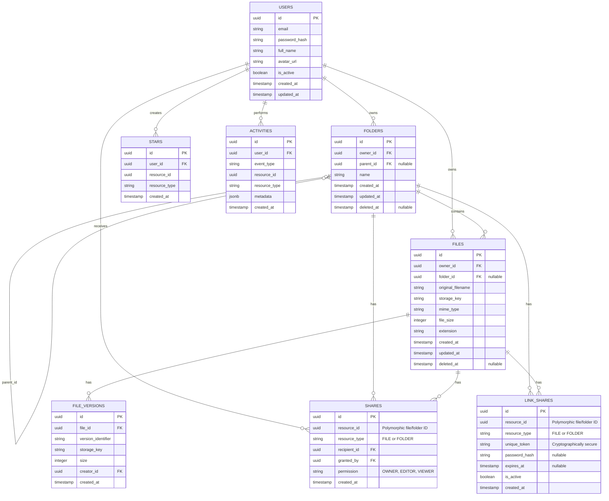

# Zuvio - Database Design Document

## 1. Database Technologies
* **RDBMS:** PostgreSQL
* **ORM:** SQLAlchemy (or SQLModel)
* **Migrations:** Alembic
* **Primary Keys:** UUID (v4) for all primary entities to prevent ID enumeration and ensure uniqueness across distributed systems.

## 2. Entity-Relationship (ER) Diagram

## 3. Key Constraints & Policies
* **UUIDs:** Used for all `id` fields.
* **Cascades & Deletions:** 
  * Hard deletions of users cascade to their owned files and folders.
  * Normal file/folder deletion is handled via `deleted_at` (Soft Delete). Queries must default to filtering out `deleted_at IS NOT NULL`.
* **Folder Hierarchy:** `parent_id` references `folders(id)`. Root level items have `parent_id = NULL`. Business logic must detect and prevent circular folder loops.
* **Stars:** A composite unique constraint on `(user_id, resource_id)` prevents duplicate starring.
* **File Storage Keys:** The `storage_key` must be unique to prevent collisions in the object bucket.
